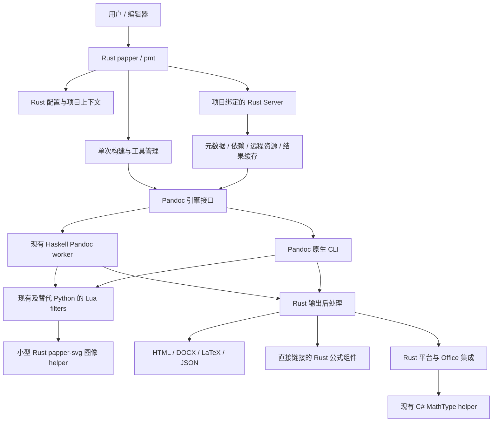

# Papper 全量 Rust 迁移计划

日期：2026-10-02

状态：已在 `rust-migration` 分支实施；实施结果与验证边界见 [RUST_MIGRATION_STATUS.md](RUST_MIGRATION_STATUS.md)
目标：将 Papper 的 Python 应用与业务逻辑迁移至 Rust，保留现有 Lua filters、Haskell worker 和 C# MathType helper，保持现有文档行为、命令使用方式和 PyPI/uv 安装体验，消除 Python 产品运行时

2026-10-03 修订：按用户的新要求，六个旧 Python filters 使用 Pandoc 进程内 Lua
实现，仅 SVGZ 解压和 PNG 像素渲染保留独立小型 Rust helper；公式组件以 Rust crate
直接链接，配置使用真实 Rust 字段。本计划以下目标架构与阶段清单已同步修正；
初次迁移 `9f4dabc` 的测试、wheel 和性能记录仍是历史验收，新的整合验证另行记录。

## 1. 决策与完成定义

采用分阶段全量迁移 Python 产品代码。先建立可验证的 Rust CLI 与配置核心，再迁移 HTML 服务、其他输出目标、DOCX 后处理、MathType/Office 的 Python 调用层和发布工具链。每个阶段交付可运行的功能，而最终交付不依赖 Python 后端或 Python 启动包装。

本计划中的“全量 Rust 迁移”指 Python 产品运行时的完整替换。Lua filters、Haskell worker 和 C# MathType helper 明确保留，不要求改写，也不属于未完成项。按以下边界执行：

| 内容 | 最终处理方式 | 是否属于迁移完成条件 |
| --- | --- | --- |
| `src/pandoc_manuscript/` 中的应用、配置、服务、文档后处理与集成逻辑 | Rust 实现替代 | 是 |
| `pandoc/filters/` 中的 Python filters | Lua filters 替代；SVGZ/PNG 像素处理使用小型 Rust helper | 是 |
| 自有 Lua filters 中的排版、语法解释和文档变换 | 保留现有 Lua 实现，由 Pandoc 引擎继续执行 | 不要求语言迁移；调用顺序、资源交付和行为必须验证 |
| 自有 Haskell worker 的项目业务逻辑、缓存策略及扩展 | 保留现有 Haskell 实现，由 Rust 服务管理并通过协议调用 | 不要求语言迁移；协议、生命周期和性能必须验证 |
| 自有 C# MathType helper | 保留现有 C# 实现，由 Rust 调用并随平台制品交付 | 不要求语言迁移；调用、依赖和打包必须验证 |
| 现有 `mathtype-rust`、`latex2wmf` | 复用现有 Rust 实现，调整调用边界 | 已有资产，不重复重写 |
| 上游 Pandoc、citeproc、pandoc-crossref、Lua 解释器等 | 继续作为外部原生引擎依赖使用 | 不要求重写上游项目 |
| Markdown、YAML、CSL、HTML 模板、参考 DOCX、字体和静态资源 | 保留为数据与模板 | 不属于代码语言迁移 |
| 测试、基准和发布辅助脚本 | 逐步迁移为 Cargo 工具或 CI 声明；Python 对照工具只在过渡期使用 | 最终移除仅为旧产品服务的脚本 |

最终不再有“Rust 程序每次启动 Python 来完成构建”的路径。过渡期可以保留旧 Python 对照实现，但必须有可追踪的移除条件。

最终产品是 Rust 应用层配合现有 Lua、Haskell 和 C# 组件。Haskell worker 继续承载现有引擎扩展与原生缓存，Lua filters 继续承载现有文档变换，C# helper 继续承载现有 MathType SDK 集成；这些都是正式架构的一部分。上游 Pandoc/citeproc/crossref 同样保留，本次不重写转换引擎。

当前要求 Python 配置使用 `pydantic-settings`。本次用户明确要求全量 Rust，因此新 Rust 产品路径使用原生配置实现，并复现 Pydantic 已有的可观察行为；过渡期 Python 代码仍遵守原配置规范。本计划不自动修改 `AGENTS.md`。

## 2. 当前基线与必须重新核实的内容

计划编写时，`pyproject.toml` 的版本为 **0.9.2**；最近可见 HEAD 为 `f343e78`。工作区和暂存区已有引擎、发布及快照变更，因此不能仅用这个提交号代表最终基线。阶段 0 需要冻结包含已接受变更的完整版本，并记录提交、工作树内容与引擎摘要。

实施时已确认迁移基线为 `55f0d9c`（Pandoc 3.12 兼容变更已提交），新分支为
`rust-migration`。基线完整测试为 259 passed、14 skipped；原始日志保存在
`output/rust-migration/baseline/`。下文的历史分析与阶段设计保留，验收以实施报告为准。

当前实现包含：

- Python CLI、配置合并、工具安装、项目状态管理、HTML Server 和文档后处理。
- Haskell 共享 Pandoc CLI/worker；当前 Cabal 配置使用 Pandoc 3.12、citeproc 0.14 系列和 pandoc-crossref 0.3.25。
- 自有 Lua filters 与 6 个 Python filters，包括 SVG、DOCX 公式和 LaTeX 资源处理。
- 既有 MathType/公式渲染 Rust 子模块，及 Windows C# helper。
- Windows、macOS 和 Linux manylinux 平台 wheel、PyPI trusted publishing、私有子模块构建与原生引擎 smoke checks。
- 用户可调用的 Python 公式转换 API，以及 `papper`/`pmt` 两个命令入口。

2026-10-01 的可行性实验得到以下历史结果：

| 真实论文场景 | `uv run papper` | 直接运行 Python CLI | 轻量 Python 原型 | Rust 客户端原型 |
| --- | ---: | ---: | ---: | ---: |
| 修改正文 | 748 ms | 654 ms | 380 ms | 251 ms |
| 内容不变 | 453 ms | 371 ms | 96 ms | 16 ms |

实验使用独立热服务、10 次正式样本、2 次预热；192 次输出对照通过。原型仅包含两次版本检查、一次构建和输出写入，配置已由父进程准备，没有实现完整 CLI、启动、配置覆盖与错误恢复契约。这些数字证明减少客户端初始化有潜力，不能当作完整 Rust 版本的性能结果。

历史证据：[分析](output/benchmarks/rust-feasibility/20261001T125925.779547Z/assessment.md)、[原始样本](output/benchmarks/rust-feasibility/20261001T125925.779547Z/results.json)、[汇总](output/benchmarks/rust-feasibility/20261001T125925.779547Z/summary.md)。引擎和快照已经变化，实施时必须重新测量，不直接沿用历史数据作发布验收。

## 3. 目标架构



CLI、单次构建和 Server 共用配置及文档业务模块，避免出现两份配置优先级或两份样式处理逻辑。CLI 的热路径只做参数解析、项目身份检查、构建请求与安全输出；Server 承担可缓存的元数据准备与依赖检查。

### 3.1 Cargo workspace 组织

先采用少量职责明确的 crate，在确有独立依赖或平台边界时拆分，不为每个 Python 模块机械建立一个 crate。

```text
Cargo.toml / Cargo.lock / rust-toolchain.toml
crates/
  papper-cli/       papper、pmt 入口与内部 server/解码/PDF 子命令
  papper-core/      配置、项目上下文、资源、工具管理、构建请求
  papper-engine/    Pandoc CLI/worker 协议与生命周期
  papper-server/    HTTP、任务调度、缓存、服务状态
  papper-document/  HTML/DOCX 后处理与公式集成
  papper-platform/  Windows COM、SDK、PDF 与跨平台适配
  papper-svg/       SVGZ 解压与 PNG 像素渲染，不依赖 core 或内嵌运行时
tools/
  papper-dev/       对照、快照、基准、资源检查与发布辅助
```

保留 `template/`、`pandoc/` 的资源角色。现有 Rust 子模块先按固定 revision 复用，后续是否并入 workspace 根据私有仓库、许可证和独立发布需求决定，不为了目录整齐改变其所有权。

候选基础组件包括原生命令行解析、Serde 数据模型、HTTP 客户端/服务、ZIP/XML、HTML DOM 和 Windows COM 支持。具体库、版本、MSRV 和 feature 集合在阶段 1 锁定，并通过代表性文件验证。库的存在不等于能够完整替代现有文档行为。

特别避免把整套公式渲染、字体扫描、PDF 引擎或 Office 初始化放在 CLI 启动路径上。只在对应功能真正执行时初始化。

### 3.2 配置与项目上下文

Rust 中使用一个共享配置核心，以真实字段、枚举和 Option 表达自有设置，受控更新并保留显式提供集合。明确区分“没有提供”“显式 false”“显式空值/auto”和“有效值”，保留 CLI 是否显式设置某个选项的信息；任意 Pandoc 元数据保留映射。

阶段 0 从现有代码和行为实验记录完整优先级，不在迁移时假设所有场景都采用一种简单覆盖顺序。至少涵盖：

- 语言默认、项目/稿件样式自动发现、显式 `--style-file`、Markdown YAML、命令行覆盖和 reply 专用配置。
- camelCase、kebab-case、snake_case 和历史别名；布尔、数字、单位、空值及错误配置的处理。
- Papper 配置与透传 Pandoc metadata 的区分，未知 Pandoc 字段和嵌套数据保留。
- 环境变量支持范围；不让系统 `LANG` 等环境变量意外改变稿件配置。
- cwd、Markdown 所在目录、显式资源路径、项目身份与输出位置的差异。
- YAML anchors/aliases、合并、重复键及字符串/数字语义：以当前实际行为建立契约，不自行新增隐式转换。

每次请求持有不可变的有效配置快照。CSS、DOCX 属性和 filter 参数由同一份已校验的配置生成，避免请求之间共享可变全局 Settings。

### 3.3 引擎与 filters

保留现有共享 Pandoc CLI/worker 能力，包括独立 CLI 使用、Lua 支持、资源数据、crossref/citeproc 顺序，以及 worker 的缓存与恢复。语言迁移不与 Pandoc 升级、引用样式变化或默认输出变化混在同一次验收中。

Rust 应用与保留组件之间的边界按以下方式实现：

1. 记录现有 Lua filters、Haskell worker 和 C# helper 的输入、输出、调用顺序、协议与生命周期，不改变其语言归属。
2. 六个 Python filters 改为 Pandoc 进程内 Lua，保持文档格式、顺序和作用域，不再启动主 CLI 来传输 AST JSON。
3. Lua filters 继续由现有 Pandoc 引擎执行，保持顺序、全局环境、资源路径和自定义第三方 filter 支持。
4. Haskell worker 保留现有 citeproc/crossref 扩展与缓存。Rust 管理 worker 进程、请求调度与应用层缓存，不重写 Haskell 内部引擎业务。
5. C# helper 保留现有 MathType SDK 接入。Rust 替换 Python 调用层，保留参数、结果、错误、超时与平台依赖语义。
6. Lua 共享资源和 SVG 处理逻辑，仅按需调用不内嵌 runtime 的 `papper-svg` 完成 SVGZ 解压/PNG 渲染；宽图使用 `pandoc.write`，不逐图启动 writer。

明确两层缓存的职责：Rust Server 负责项目状态、配置、文件依赖、远程资源与构建结果；Haskell worker 负责现有引擎内部对象及转换缓存。协议携带必要的配置、依赖与版本信息，避免配置变化后仍复用旧引擎结果。

优先复用当前 worker 与 helper 的调用协议。协议扩展或 filter 调用优化只有在输出、异常恢复和性能实验通过后才切换，不把重写保留组件当作迁移前提。

### 3.4 状态、缓存与输出

- 继续按项目绝对身份隔离服务和状态，迁移时处理 Windows 大小写、Unicode、UNC、符号链接和路径规范化。
- 缓存 key 包含产品/引擎/协议版本、有效配置、输入、依赖与模式，不兼容版本使用新命名空间。
- 配置相同不重写状态文件，不因 mtime 变化无意义重启 worker。
- 文件缓存观察内容变化、替换、删除和重新创建，包括更高优先级资源后来出现的情况。
- 远程 CSL/参考文献保持 TTL、ETag、Last-Modified、304 和离线/失败处理语义；没有有效缓存时不以空内容继续构建。
- 保存当前所有可观察的 cache header、timings、metrics 和请求契约，新增协议版本支持能力协商。
- 输出先写同目录临时文件，成功校验后发布；Windows 目标被 Word 占用等情形保留旧文件并报告可操作错误。
- 取消、下载中断、转换失败不得污染缓存或删除用户原稿；不让后续请求拿到半成品。

## 4. 全功能迁移清单

| 领域 | 当前主要位置 | 必须交付的行为 |
| --- | --- | --- |
| CLI | `cli.py`、`commands/common.py` | 所有子命令、`pmt` 别名、选项、帮助、版本、退出码、详细日志、Ctrl-C |
| 初始化与模板 | `commands/init.py`、`template/` | 中英文模板、目录/文件冲突策略、用户文件保全、初始化后可构建 |
| 工具安装与诊断 | `commands/setup/`、`commands/doctor.py` | 已打包引擎优先级、旧工具兼容、代理、下载校验/恢复、安装诊断 |
| 配置与项目状态 | `runtime/`、`html/server_metadata.py` | 优先级、别名、语言、路径与资源、状态清理、更新检查 |
| 构建 | `commands/build.py` | HTML、DOCX、LaTeX、JSON、显式输出和配置覆盖 |
| HTML 服务 | `commands/pandoc_server*.py`、`server_assets.py`、`server_remote_assets.py` | 冷启动、热复用、资源刷新、请求一致性、并发、限界、worker 恢复 |
| HTML 格式 | `html/`、相关 filters | CSS 继承、页边距、作者/单位、通信作者、表格与完整输出 |
| DOCX 格式 | `docx/`、相关 filters | 样式、表格、公式、图像、行号、页号、脚注、书签/字段与原生交叉引用 |
| 公式与 OLE | `mathtype/`、两个 Rust 子模块 | 默认 Rust 转换、各历史转换方法、OLE/MTEF/WMF、字体/偏好、错误恢复 |
| 格式转换 | `commands/convert.py` | DOCX→Markdown、公式解码、输出资源和现有工具调用 |
| 审稿回复 | `commands/build_reply/` | 回复目标、配置、蓝色/斜体、行号来源、DOCX/PDF→行号匹配 |
| 平台适配 | Word COM、SDK、PDF/soffice、图像处理 | 各平台当前支持范围、明确错误、资源/应用所有权 |
| filters | `pandoc/filters/` | Python filters 改为 Lua，既有 Lua 保留；小型 Rust helper 仅处理图像，所有自定义语法、属性和顺序兼容 |
| 保留组件集成 | Haskell worker、Lua filters、C# MathType helper | Rust 调用、生命周期、版本、资源和平台制品兼容；组件不要求改写 |
| Python 对外 API | `mathtype/native.py` 等 | 逐项决定兼容层或版本化移除，不能无公告破坏已有调用方 |
| 分发与开发工具 | `hatch_build.py`、CI、测试/基准脚本 | 原生 wheel、资源定位、签名/版本、平台构建、快照和基准 |

运行时独立于 Python 与保留 Python 调用接口可以同时实现：如需要兼容旧公式 API，提供单独的可选薄绑定包调用 Rust 库，主 `papper` 包不依赖它。是否保留、如何命名、版本支持期限在阶段 0 明确；本计划不默认直接删除已公开 API。

## 5. 实施阶段与退出条件

每个阶段完成前检查“行为是否等价、输出是否正确、数据是否保全、目标平台是否可交付”。不以代码翻译比例或新增测试数量判定完成。

### 阶段 0：冻结基线和行为清单

交付：基线源码/引擎版本记录、CLI/配置/资源契约清单、功能归属表、现有快照、重新测量的性能报告和迁移待办。

- 先处理和接受当前待提交的工作，再冻结完整基线；不覆盖已有暂存内容。
- 保存参考实现于独立 checkout/归档，原稿只读，对照使用临时项目副本。
- 跑当前完整测试，记录实际通过/跳过/外部依赖；历史“235 通过”不代表当前版本已验证。
- 覆盖 `init/setup/build/convert/build-reply/clean/distclean/doctor` 和两个入口，记录实际输入、结果与错误。
- 核实 wheel 中原生引擎、数据、SDK helper 与共享库的实际组成。
- 定义 Python API 的支持策略和当前支持的平台/架构，不把 CI runner 名称当成实际二进制架构。
- 重新测量 HTML、DOCX、LaTeX、JSON、公式和审稿回复的代表性工作负载。

退出条件：有一个可复现、可运行的参考产品；现有失败已登记归属，没有把旧失败隐藏为迁移差异。

### 阶段 1：Rust 基础与原生分发样机

交付：Cargo workspace、共享配置模型、项目路径/资源层、原生 `papper`/`pmt`、本地 wheel。

- 先实现版本、帮助、命令框架、配置读取和错误类型，不执行删除/清理等高风险操作。
- 从同一命令定义生成帮助，保留别名和短参数；对外错误按用途分类，不暴露 Rust panic。
- 验证 Unicode/空格/UNC 路径、环境语义、显式空值、类型和别名冲突。
- 构建包含真正 Rust 可执行文件的 wheel，隔离使用 `uv tool install` 安装。
- 测量安装后直接运行 `papper`、直接二进制和 `uvx papper`；确认 native 入口不创建 Python 子进程。
- 验证 `pmt` 与 `papper` 的行为一致，资源不依赖源码 checkout 或 Python site-packages 查找。

退出条件：安装后的原生入口可独立启动，配置契约代表用例通过，打包方式未引入 Python 启动器。

### 阶段 2：完整 HTML 构建与 Rust Server

交付：Rust HTML 单次构建、热服务客户端、Rust Server、项目/元数据/依赖缓存、现有 engine 适配。

- 先让 Rust 客户端通过现有 Server 的版本化接口工作，再迁移 Server；阶段终点移除 Python 服务依赖。
- 请求显式包含 path、项目身份、配置覆盖和模式等所需数据；校验调用方/服务能力与请求参数，不假设旧 config 永远正确。
- 覆盖无服务、端口占用、错误项目、失效 PID、并发启动、捕获 stdout 后后台服务退出句柄，以及 worker 崩溃恢复。
- 建立项目任务事务，限界队列/缓存；读取源与依赖形成一致快照，避免同时编辑或并发请求污染结果。
- 迁移 CSS、作者信息和表格后处理；HTML 解析器/序列化差异先定位再决定是否属于允许的输出变化。
- 从旧版本继承所有已确认的服务端接口，是否有 preview/未保存 source text 等能力以阶段 0 清单为准。
- 完成至少一个 Python filter 的 Lua 替代接入实验，验证进程内 AST 处理、保留 filters 的顺序与 Haskell worker 缓存行为；图像 helper 单独测量启动成本。

退出条件：完整 HTML CLI/Server 输出与基线一致；不启动 Python；缓存失效、失败恢复和性能目标通过；不是仅用固定配置的原型演示。

### 阶段 3：其他目标、工具管理和 Python filters

交付：Rust `build latex/json`、模板初始化、setup/doctor、clean/distclean、更新检查，六个旧 Python filters 的 Lua 替代与小型 Rust 图像 helper。

- 复现 JSON AST、LaTeX 资源复制与图像转换行为；不只验证构建退出码。
- 保持源码与安装包两种资源加载方式，发布资源清单带版本及摘要。
- 以原子替换处理工具下载/解包/修复，保留系统代理和显式代理的优先级及失败恢复。
- `clean/distclean` 只操作正确项目的既定状态，不扩大删除范围；兼容旧状态时先识别版本。
- 以 Lua 移植 SVG 内嵌、公式/LaTeX filters 和 SVG→PNG 的 AST/缓存规则，像素处理调用小型 Rust helper；保留尺寸、字号、字体和 per-image 控制。
- 诊断输出基于实际可用能力，不把所有平台都宣称支持 Windows SDK 路径。

退出条件：上述命令和 Python filters 的行为契约通过；这些路径无 Python 回退。

### 阶段 4：DOCX 包处理与后处理

交付：Rust DOCX 包操作、参考文档处理、样式/表格/公式/作者/编号后处理和数据保全。

- 优先建立保留未知 ZIP entries、未知 XML 与二进制部件的包编辑模型，不默认读取进类型模型后重建整个文档。
- 评估 XML 命名空间、mixed content、`xml:space`、relationship、content types、压缩与字节保真策略。
- 按现有顺序迁移作者/脚注、字体/段落、行号/页号、表格属性、子图、公式布局和修订格式。
- 原生交叉引用保留字段指令、缓存显示值、编号定义、跨部件书签和引用目标关系。
- 保留图片/OLE/嵌入对象，不因不认识 XML 或关系类型而丢弃内容。
- 把验证放在最终产物上：XML 结构、包关系、快照、可打开性及代表性 Word/LibreOffice 检查。
- 失败时保留已有目标和原始输入；处理文档占用、写出失败及中断。

退出条件：DOCX 快照和已公开样式/语法行为通过；图像与 OLE 内容保全；不依赖 python-docx/lxml；没有以更新快照掩盖迁移差异。

### 阶段 5：MathType、Office、转换与审稿回复

交付：Rust 公式调用层、OLE/文档转换、`convert`、`build-reply`、PDF/Office 平台实现。

- 通过安全 Rust 门面直接链接现有公式 crate 和相同固定 revision 的 `latex2wmf`，不为自有 Rust→Rust 调用保留动态加载及 JSON/hex C ABI。
- 公式缓存采用构建期引擎指纹和独立 schema；偏好、字体和 helper 等可变输入仍在运行时验证，不扫描 DLL 或整份源码。
- 保留 `rust`、`rust-sdk`、`set-data`、`auto`、`both` 等当前支持的方法，逐项标注平台前提。
- 保留现有 C# MathType helper，Rust 替换其 Python 调用层；验证参数、输出、错误、超时、SDK 前提与平台打包，不要求将 helper 业务改写为 Rust。
- COM 优先附加已有 Office 实例，只管理本次打开的文档，绝不调用 `Application.Quit()` 或关闭用户已有文档；不启动 Office 来跑普通无 Office 构建。
- PDF 引擎须保留文本位置、bbox、字体/行号匹配行为；不能仅以提取文本相似判定等价。
- 迁移 DOCX→Markdown、MathType 解码、回复格式、line-source 导出与正文匹配，并保留输入/输出资源。
- 新原生 PDF/SDK 依赖在选型时核实平台打包与分发条款；外部程序耗时单独测量。

退出条件：所有现有转换与回复模式按当前平台支持范围通过；Office 用户数据保全；无 Python 回退；现有 C# MathType helper 可由 Rust 正常调用并随支持平台交付。

### 阶段 6：保留组件集成与端到端性能收敛

交付：Rust 应用与现有 Lua filters、Haskell worker、C# MathType helper 的完整集成，固定组件协议与制品清单，以及迁移后性能报告。

- 按读者/AST/交叉引用/引用处理/写者阶段，验证新迁 Lua filters 与既有 filters 的位置和作用域；图像 helper 不承载 AST JSON。
- 对嵌套表格、重复标题、脚注、全局链接、修订语法和中英文编号验证完整输出，不通过改写 Lua 来绕过调用差异。
- 验证 Haskell worker 的版本协商、配置更新、citeproc 原生缓存、crossref 嵌入、并发限制与崩溃恢复。
- 自定义第三方 Lua/JSON filters 保持可用，内置优化不得吞掉用户 filter 或改变其顺序。
- 在安装包中验证 C# helper、SDK 前提、MuPDF 共享库、小型图像 helper、Lua 资源和 worker 数据均可定位。
- 对完整链路进行 profile，优化 Rust 应用层与组件交互；若需修复保留组件，沿用其现有语言，不扩大 Rust 重写范围。

退出条件：三个保留组件的集成与发布验证通过；所有 Python 产品路径已替换；性能目标及输出契约通过，没有新增跨组件开销导致总体性能退化。

### 阶段 7：发布切换与移除旧运行时

交付：原生平台 wheels、独立二进制发布、Rust 验证工具、升级说明、旧 Python 运行时移除。

- 主 `papper` 包采用原生 binary wheel；保留 PyPI 包名和两个命令入口，不继续定义指向 Python 函数的主入口。
- 复用当前 trusted publishing 和平台构建矩阵，先以本地 wheel/预发布验证，再切换正式发行。
- 打包 Pandoc 引擎、数据、模板、公式库及必要依赖；从任意 cwd 启动，不依赖开发机环境。
- 将 Python-only 产品依赖和旧 Hatch 构建路径在功能关闭后移除；测试/基准迁移至 Rust 开发工具。
- 如果保留可选 Python API，则单独验证和说明，主 CLI 不经过它。
- 验证升级/降级、旧项目模板、新项目模板、旧服务状态和缓存版本；升级不得误复用不兼容 worker。
- 保留一个已发布旧版本作为安装级回退，不能把覆盖用户缓存或重置用户工作区当作回退方案。

退出条件：用户从 PyPI 用 uv 安装的正式构建在全部支持平台通过；运行产品命令无需 Python；旧代码移除而不是默认隐藏。

## 6. 性能验收

以阶段 0 的新基线为准，性能与输出正确性同时验收。以下为设计目标，不是已实现的保证：

| 指标 | 目标 | 边界 |
| --- | --- | --- |
| 真实论文热 Server，正文修改后的完整命令 | 对直接安装的基线 CLI 中位数减少至少 50% | 新客户端启动→退出，包含配置、请求和输出写入 |
| 同场景绝对耗时 | 同等实验机器争取 280–350 ms | 若新引擎基线变化，先报告原因再修订目标 |
| 内容不变的完整命令 | 争取 20–60 ms | 包含真实配置/依赖验证，不能跳过校验取得数字 |
| Rust 客户端额外开销 | 在 Server 实际耗时之外争取不超过 30 ms | 使用同一请求的服务端/客户端证据归因 |
| Server 单次转换 | 对同引擎基线争取无回归 | Python 热导入已摊销，不承诺仅换语言再减半 |
| DOCX/LaTeX/转换/回复 | 先测基线，再按热点设目标 | 外部 Word/soffice/PDF/公式引擎时间独立记录 |

测量方法：

1. Windows、Linux、macOS 分别测原生安装入口，另列 `uvx`/`uv run` 路由，不把 uv 外层时间算作 Rust 本体。
2. 固定稿件、资源、引擎二进制、配置与字体；CLI 语言迁移和引擎升级分开比较。
3. 正式性能报告使用不少于 15 个样本、至少 2 次预热，交错顺序，保留全部样本，记录中位数与 p95。
4. 分别测首次启动、热正文编辑、引用编辑、配置/资源编辑和内容不变；冷启动不混入热构建结果。
5. 校验输出、cache hit/miss 与服务是否重启；原稿只读，副本可写，测量结束只清理实验自己的进程与目录。
6. 原始数据记录产品/协议/引擎版本、源码摘要、worker 摘要、OS/架构、字体、样本和阶段耗时。
7. 不为追求中位数而删异常样本、降低 cache invalidation 强度或跳过元数据准备。

若目标未达到，按 CLI 启动、配置、I/O、缓存、AST 传输、worker、后处理和外部应用分解；调整实现，不把“Rust 天生更快”当成验收证据。

## 7. 兼容验证与快照策略

迁移期采用同一输入分别执行冻结的 Python 参考版和 Rust 版的黑盒对照。既有快照作为起点，只补充能独立验证用户行为、已有覆盖不足的案例。

必须验证：

- CLI：命令/参数、`papper`/`pmt`、帮助、版本、退出码、错误含义、stdout/stderr 和中断。
- 配置：优先级、别名、空值、语言、显式样式路径、环境隔离和嵌套透传。
- HTML：引用、交叉引用、中英文编号、作者/单位、表格、CSS、资源路径和完整文档输出。
- DOCX：每个解包 entry，canonical XML、二进制摘要、关系/字段/书签目标、公式和图片尺寸。
- Server：源/依赖变化、删除/替换/新增资源、远程刷新、并发、错误项目、worker 崩溃与服务升级。
- 数据保全：失败和取消后旧输出仍在、原稿不变、清理范围正确、Office 用户文档不被关闭。
- 安装包：独立环境、任意 cwd、无源码仓库、无 Rust/GHC 构建工具、无 Python 产品回退。

可规范化平台换行、ZIP 元数据和已定义的随机标识；规范化必须保留标识之间的映射、引用目标与用户内容。不得广泛删除 HTML 属性/XML 节点来让快照通过。

保留现有 focused syntax fixtures，包括 table attributes、text styles、author affiliations、equation attributes、SVG rasterization、native crossrefs 等。每新增特殊 Markdown 语法，添加独立快照案例。迁移原则上不扩展语法，避免同时修改语言与输出契约。

禁止新增只检查常量、文件存在、模块引用或 mock 调用次数的测试。mock 仅用于外部边界，断言落在最终行为上。更新快照须说明输出变化及原因，纯迁移差异不能默认接受。

每个阶段运行受影响的行为测试；全局配置、引擎、DOCX 或默认入口切换时跑完整保留测试。最终所有平台的测试/安装验证是发布门槛，不以某台开发机通过替代。

## 8. PyPI、uv 与资源交付

原设计采用 Maturin `bin` 模式。实施时改为 `papper-dev` Rust wheel builder：
Haskell、C#、MuPDF、图像 helper 和平台运行库需要在资源归档内嵌前统一暂存和修复；
公式库直接编译进 CLI，不再作为 DLL 资源暂存，
因此由同一个原生工具完成组件构建、依赖审计、PEP 427 wheel 和安装 smoke。
wheel 的脚本目录仍包含真正的 Rust 可执行文件。源码安装保留一个仅在构建时运行的
PEP 517/660 Python 桥接模块，正式 wheel 和普通产品命令不包含或调用它。

```text
安装：uv tool install papper
运行：papper build html --start-server
升级：uv tool upgrade papper
```

安装后直接运行的链路为 Shell→Rust 二进制。uv 官方文档说明工具入口包含原生 binary scripts，在 Unix 链接、Windows 复制到可执行目录；目录名为 shims 不意味着每次启动一个额外解释器。[uv 工具入口](https://docs.astral.sh/uv/concepts/tools/#tool-executables)。

`uvx papper` 和 `uv run papper` 仍先运行 uv，报告与文档明确区分这类便捷调用与低延迟直接调用。工具环境可能包含 Python，但 Rust 程序执行不应依赖或启动它。

发行必须考虑：

- 平台/架构和最低系统版本匹配；Linux manylinux/musllinux 选择与当前引擎原生依赖一致，不只给 wheel 改标签。[Maturin 分发要求](https://www.maturin.rs/distribution.html)。
- 主程序被 uv 复制到另一目录后，仍能找到引擎和模板。优先编译内嵌只读资源，或按版本/摘要解包到管理目录；需要真实路径的文件有清晰生命周期。
- worker/helper 与主程序的版本协商；直接链接公式的构建身份；MuPDF 等外部 DLL/dylib/so 的加载和依赖修复；不依赖开发机 PATH 和 Homebrew 安装。
- `papper` 与 `pmt` 原生入口交付、Unicode 路径、只读安装目录和离线运行。
- 初次解包/安装时间与热运行时间分别报告，不把每次资源展开放在普通请求上。
- 预编译 wheels 覆盖正式支持平台；源码包构建要求和私有子模块访问要如实说明，不能承诺未授权的用户能重建私有源。
- 发布制品只含所需资源与原生组件，不含访问令牌、私人配置、基准原稿或构建调试产物。

正式发布前完成可审查制品、隔离安装验证与升级说明，并确认原生入口、资源和所有支持平台的依赖可用。

## 9. 风险、处理方式与回退

| 风险 | 处理方式 | 暂停该阶段切换的条件 |
| --- | --- | --- |
| 配置重写改变默认值、别名或优先级 | 单一配置核心、显式 provided 信息、参考版黑盒对照 | 同输入不同有效配置/输出 |
| DOCX 读写损坏或丢失未知对象 | 包/XML 局部修改、entry/二进制保全、真实应用检查 | 未知部件丢失、关系/字段错误 |
| 新迁 Lua filters 与既有 filters 的顺序或图像 helper 边界改变行为 | 固定引擎/Lua/渲染器版本、保持顺序、AST与像素对照及阶段 profile | 输出差异或跨边界性能回归 |
| Rust 调用现有 worker/helper 时破坏协议或生命周期 | 保留协议、能力协商、错误/超时/恢复与安装制品验证 | 引擎缓存失效错误、helper 调用失败或组件不可定位 |
| 引用缓存误复用 | 上游对象生命周期明确、依赖 key、失败不发布缓存 | 编辑引用/CSL 后仍旧内容 |
| PDF/Office 绑定行为不等价 | 先验证位置数据、SDK 调用与 COM 所有权 | 用户文档被关闭、行号映射错误 |
| wheel 原生依赖不可加载 | 各平台独立安装 smoke、加载路径和最低 OS 验证 | 只有开发 checkout 可运行 |
| 私有子模块阻碍源码发行 | 固定 revision、构建权限与源码分发说明 | 制品无法合法/可复现构建 |
| 双实现长期分叉 | 每阶段有关闭条件、共享 fixtures、Rust 默认切换后移除旧业务 | 新功能只存在于旧后端 |
| 假提速来自少做工作 | 完整命令、cache 计数、输出与错误契约同时验证 | 跳过配置/依赖检查或比不同语义 |

回退通过安装已验证旧版本、选择其对应引擎和状态命名空间完成。升级尽量采用新增版本目录，避免覆盖正在运行的 worker/DLL。保留用户项目和输出，不自动删除旧缓存来掩盖兼容问题。

## 10. 工作顺序、里程碑与最终清单

顺序依赖：

```text
阶段 0 基线
  → 阶段 1 Rust 核心与分发
  → 阶段 2 完整 HTML 与 Rust Server
  → 阶段 3 其他目标/工具/filters
  → 阶段 4 DOCX
  → 阶段 5 平台/转换/回复
  → 阶段 6 保留组件集成与性能收敛
  → 阶段 7 正式发布与旧运行时移除
```

阶段 2 的引擎接入实验、阶段 4 的 OOXML 包保全实验、阶段 5 的 PDF/SDK 绑定实验可在其前置契约明确后提前验证。它们是早期技术风险，不应等到大部分重写完成后才发现不可行。

不预先给出固定工期：当前存在持续引擎/快照变化，且 DOCX、PDF 和 SDK 绑定需要真实兼容实验。阶段 0/1 完成后，按已关闭行为、剩余清单和技术实验结果估算后续工作，而不是依据代码行数承诺日期。

建议里程碑：

| 里程碑 | 可审查交付 |
| --- | --- |
| M0 | 冻结参考版、契约和新性能基线 |
| M1 | uv 可安装的原生入口与共享 Rust 配置 |
| M2 | 全功能 HTML CLI/Server，无 Python 热/冷构建路径 |
| M3 | 所有普通目标与工具命令、Python filters 已迁移 |
| M4 | DOCX 输出与保全契约通过 |
| M5 | 公式/Office/转换/审稿回复完整 |
| M6 | 现有 Lua filters、Haskell worker、C# MathType helper 集成与性能验收通过 |
| M7 | 全平台原生发布，旧 Python 产品运行时移除 |

最终完成清单：

- [x] 所有现有产品命令和配置行为已迁移，两个入口可用。
- [x] 单次构建、热 Server、冷启动、失败恢复与用户数据保全通过当前 Windows 契约和安装 smoke。
- [x] HTML/DOCX/LaTeX/JSON、公式、转换、回复输出通过契约验证。
- [x] 自有 Python filters 全部替换；现有 Lua filters、Haskell worker、C# MathType helper 保留，Lua/Haskell 与默认公式路径通过 Windows 行为和打包验证；C# helper 已交付，可选真实 SDK 验收边界记录于实施报告。
- [x] 普通产品调用不启动 Python，不依赖 PyO3 嵌入解释器或 Python console script。
- [x] 可选 Python API 的兼容/移除策略落实并说明：原生 wheel 移除旧 Python 导入 API，使用 CLI 或 Rust 库；旧实现仅在测试对照目录保留。
- [x] 新基线下的完整安装制品热构建报告达到减少 50% 的目标；正文编辑减少 56.9%，不变内容减少 86.8%，冷启动另行记录。
- [ ] PyPI/uv 安装、原生直接运行和资源加载在所有支持平台通过。
- [x] 当前 Windows wheel 在不使用源码资源或 Rust/GHC 编译工具的产品运行路径下可使用既定功能。
- [x] 旧 Python 产品代码和构建依赖已从运行制品移除；测试冻结对照及源码 PEP 构建桥接保留，必要外部引擎保持固定源码构建。
- [ ] 版本、状态/缓存迁移、升级/降级、发布说明和回退路径验证完成。

## 11. 首个实施批次

开始迁移时，先做以下有边界的工作：

1. 冻结当前已接受的 0.9.2 行为版本，运行完整保留测试并生成更新后的 benchmark。
2. 建立 CLI/配置/自定义语法/组件接口清单，确认 Python API 策略，以及保留 Lua filters、Haskell worker 和 C# MathType helper 的调用与交付边界。
3. 创建 workspace，完成 `papper --version`、根帮助、`pmt` 和配置读取。
4. 制作隔离可安装的 binary wheel，验证入口不经过 Python 且资源可定位。
5. 实现完整 HTML 请求协议和同输入对照，随后迁移 Rust Server。

该批次结束时必须有可运行的原生入口与可复现报告，避免先翻译大量代码再尝试集成。
