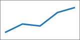

前向引用：@sec:overview、@sec:methods、@sec:details 和 @sec:results。
图、表及公式：@fig:trend、@tbl:values、@eq:circle 和 @fig:results。

# **研究概述** {#sec:overview}

## 方法 {#sec:methods}

### 模型细节 {#sec:details}

单条文献引用[@alpha2020]，连续引用范围[@alpha2020; @beta2021; @gamma2022]，
重复引用[@beta2021]，叙述式引用 @alpha2020。

脚注中的引用同样指向正文题注和文献表[^native]。

[^native]: 参见 @fig:trend 和文献[@alpha2020; @beta2021]。

{#fig:trend width=45%}

| 数值 | 含义 |
| :--: | ---- |
| 1 | 基线 |
| 2 | 候选 |

: 模型参数 {#tbl:values}

$$
x^2 + y^2 = r^2
$$ {#eq:circle}

:::: {#fig:panels}

{#fig:panel-a width=40%}

{#fig:panel-b width=40%}

组合图

::::

子图引用：@fig:panel-a 和 @fig:panel-b。

#### 超出编号深度

1. 普通列表第一项
2. 普通列表第二项

# 不编号标题 {-}

[自定义目标]{#custom-target}，保留[普通内部链接](#custom-target)。

# 结果 {#sec:results}

跨章节引用：@sec:methods、@fig:trend、@tbl:values 和 @eq:circle。
本章编号：@fig:results、@tbl:results 和 @eq:results。

{#fig:results width=45%}

| 项目 | 结果 |
| ---- | ---: |
| 甲 | 3 |

: 结果表 {#tbl:results}

$$
E = mc^2
$$ {#eq:results}
