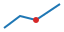

# Per-image SVG rasterization {#sec:images}

{#fig:vector}

{#fig:raster to-png=true}

{#fig:scaled to-png=true to-png-scale=2}

Compare @fig:vector, @fig:raster, and @fig:scaled. The image-level conversion
options should affect only the selected DOCX images.
